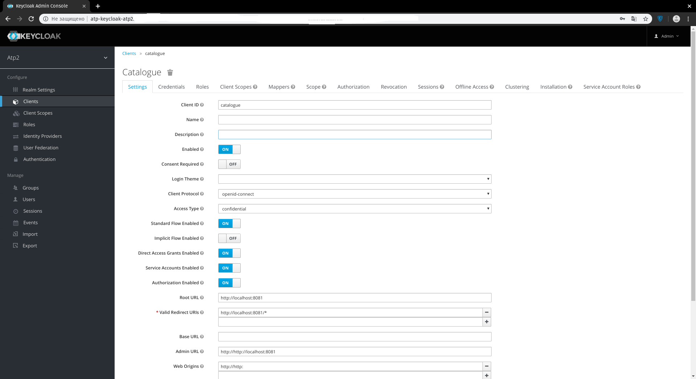
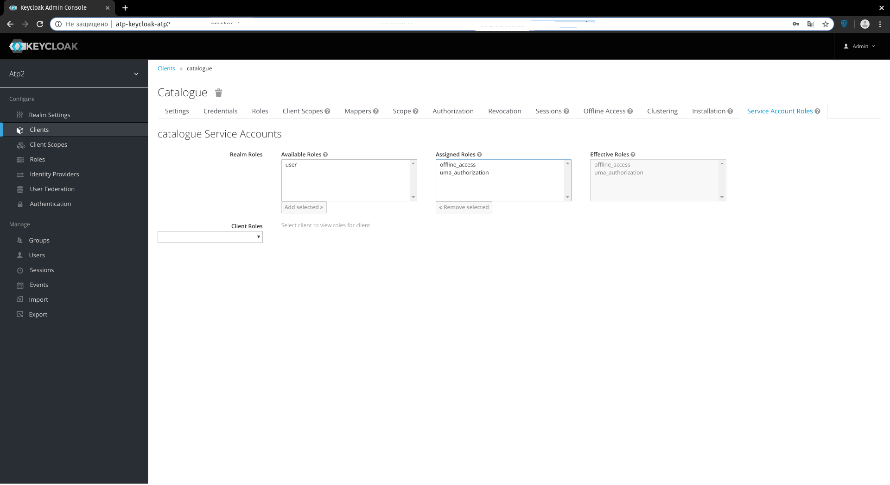
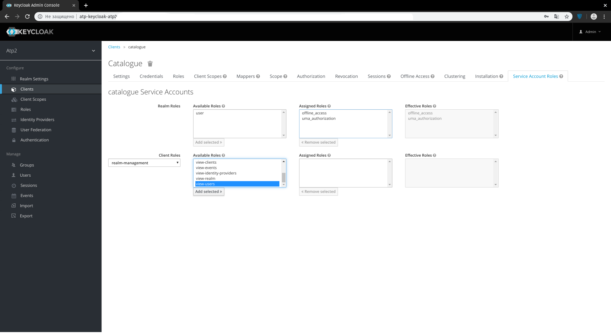

# Usage Notes

## Authentication

### 1. Add dependency into pom.xml

```
<dependencies>
    ...
    <dependency>
        <groupId>org.qubership.atp.auth</groupId>
        <artifactId>atp-auth-spring-boot-starter</artifactId>
        <version>1.2.59</version>
    </dependency>
    ...
</dependencies>
```

### 2. Add properties into application.properties

```
##==================atp-auth-spring-boot-starter=====================
spring.cache.cache-names: projects, auth_objects
spring.cache.caffeine.spec: maximumSize=100, expireAfterAccess=120s

keycloak.resource=""
keycloak.enabled=true
keycloak.bearer-only=true
keycloak.realm=${REALM_NAME}
keycloak.auth-server-url=${KEYCLOACK_AUTH_URL}

atp-auth.project_info_endpoint=${PROJECT_INFO_ENDPOINT:/api/v1/users/projects}

feign.atp.users.url=${FEIGN_ATP_USERS_URL:}
feign.atp.users.name=${FEIGN_ATP_USERS_NAME:ATP-USERS-BACKEND}
feign.atp.users.route=${FEIGN_ATP_USERS_ROUTE:/api/atp-users-backend/v1}

// if you want send service entities via kafka
kafka.enable=${KAFKA_ENABLE:false}
kafka.service.entities.topic=${KAFKA_SERVICE_ENTITIES_TOPIC:ci_service_entities}
kafka.service.entities.topic.partitions=${KAFKA_SERVICE_ENTITIES_TOPIC_PARTITIONS:1}
kafka.service.entities.topic.replicas=${KAFKA_SERVICE_ENTITIES_TOPIC_REPLICATION_FACTOR:3}
spring.kafka.producer.bootstrap-servers=${KAFKA_SERVERS:kafka:9092}

Please find additional information about how to integrate microservice with internal gateway in User Guide

```

## Authorization

### 1. Turn ON authentication according instructions above.

### 2. Use @PreAuthorize() annotation

The annotation should be placed before each backend method, if permissions should be checked before its execution.

```
@GetMapping(value = "/project/{projectUuid}")
@PreAuthorize("@EntityAccess.checkAccess(#projectUuid, \"READ\")")
public List<Defect> getDefectsByProjectUuid(@PathVariable("projectUuid") String projectUuid) {
    return service.getDefectsByProjectUuid(projectUuid);
}

@DeleteMapping(value = "/delete/{uuid}")
@PreAuthorize("@EntityAccess.checkAccess(@defectsService.getByUuid(#uuid).getProjectId(), \"DELETE\")")
public void delete(@PathVariable("uuid") String uuid) {
    akbRecordsService.removeDefectFromAkbRecord(uuid);
    service.delete(uuid);
}
```

In the annotation, checkAccess() method is used (EntityAccess component):

```
@entityAccess.checkAccess(UUID projectId, Operation operation)

// To check access in a specific entity
// It won't work if you don't first send the service entities to the user service
@entityAccess.checkAccess(String entityName, UUID projectId, Operation operation)
```

There is overloaded method for usability reasons:

```
@entityAccess.checkAccess(String projectId, String operation)
```

Also, there is bulk method to check permissions for the action under set of projects:

```
@entityAccess.checkAccess(Set<UUID> projectIdSet, String action);
```

5 action types are supported currently:

```
CREATE
READ
UPDATE
DELETE
EXECUTE
```

```
@EntityAccess.checkAccess(#projectUuid, \"CREATE\")
@EntityAccess.checkAccess(#projectUuid, \"READ\")
@EntityAccess.checkAccess(#projectUuid, \"UPDATE\")
@EntityAccess.checkAccess(#projectUuid, \"DELETE\")
@EntityAccess.checkAccess(#projectUuid, \"EXECUTE\")
@EntityAccess.isAdmin()
```

Authorization is considered successful automatically, independently on `@PreAuthorize()` checks, if the user has
`ATP_ADMIN` role. This role is configured and assigned to users in Keycloak admin console.

# M2MRestTemplate

## 1. Add properties into application.properties

```
keycloak.resource=${KEYCLOAK_RESOURCE}
keycloak.credentials.secret=${KEYCLOAK_SECRET}
```

## 2. Turn ON configuration using the annotation:

```
@EnableM2MRestTemplate
```

## 3. Add link to the bean:

The link should be added to any class where you want to make requests to external resources.

```
@Autowired
RestTemplate m2mRestTemplate;
```

## 4. Client roles configuration

Example below shows, how one can allow a catalogue client to get information about users:

1. Open client settings
   
2. Switch to Service Account Roles tab
   
3. Select roles realm-management and view-users
   
4. Click 'Add selected' button

## Remarks

If, due to some reason, you want to use m2mRestTemplate without client token getting,
you should explicitly configure it via 'atp-auth.enable-m2m' property:

```
atp-auth.enable-m2m=false
```

Default value is true.

# RelayRestTemplate and RelayWebClient

They are used to add token of current authenticated user to all requests. RelayRestTemplate is turned on be default.

## 1. The configuration can be turned ON by means of annotation:

```
@EnableTokenRelayWebClient
```

## 2. Add link to the bean.

The link should be added to any class where you want to make requests to external resources.

```
@Autowired
RestTemplate relayRestTemplate;
```

```
@Autowired
WebClient relayWebClient;
```

# OAuth2 Feign Client Interceptor

The interceptor uses token of the current authenticated user in requests to services.
If the current security context doesn't contain user token, service token is used (the same way as in m2m rest template).

## 1. The configuration can be turned ON by means of annotation:

```
@EnableOauth2FeignClientInterceptor
```

# Turning security ON and OFF by means of profiles:

## Turn ON:

This is default mode. It works in case 'default' profile is active.

## Turn OFF:

This mode can be selected if:

1.'disable-security' profile is set active:

```
spring.profiles.active=disable-security
```

2.'keycloak.enabled' is changed from true to false.

```
keycloak.enabled=false
```

# Ssl certificate verification

By default, SSL certificate verification is turned off.
To turn if on, one needs to use 'atp-auth.ssl.certificate.verify' property, and also to set path-to-certificates-folder:

```
atp-auth.ssl.certificate.verify=true
atp-auth.ssl.certificate.dir.path=/etc/ssl
```

- To ignore ssl certificates in feign clients, one should add properties:

```
feign.httpclient.disableSslValidation=true
feign.httpclient.enabled=false
feign.okhttp.enabled=true
```

- To turn off metrics of feign client, one should add property:

```
atp.feign.micrometer.enable=false
```

# RestTemplate Logging

## 1. Add properties into application.properties

```
atp.logging.resttemplate.headers=${ATP_HTTP_LOGGING_HEADERS:true}
atp.logging.resttemplate.headers.ignore=${ATP_HTTP_LOGGING_HEADERS_IGNORE:}
atp.logging.feignclient.headers=${ATP_HTTP_LOGGING_HEADERS:true}
atp.logging.feignclient.headers.ignore=${ATP_HTTP_LOGGING_HEADERS_IGNORE:}
```

By default, 'atp.logging.resttemplate.headers' value is false.

- _atp.logging.resttemplate.headers_ - To log request/response headers for RelayRestTemplate and M2MRestTemplate.
- _atp.logging.resttemplate.headers.ignore_ - To ignore specified headers while logging. Tokens should be separated with spaces.
- _atp.logging.feignclient.headers_ - To ignore request/response headers for FeignClient.
- _atp.logging.feignclient.headers.ignore_ - To ignore specified headers for FeignClient. Tokens should be separated with spaces.
- Properties _atp.logging.resttemplate.headers.ignore_ and _atp.logging.feignclient.headers.ignore_ support regular expressions.

## 2. Add configuration into logback.xml

```
<if condition='${ATP_HTTP_LOGGING}'>
    <then>
        <logger name="org.qubership.atp.common.logging.interceptor.RestTemplateLogInterceptor" level="DEBUG" additivity="false">
            <appender-ref ref="ASYNC_GELF"/>
        </logger>
        <logger name="org.qubership.atp.catalogue.service.client.feign.DatasetFeignClient" level="DEBUG" additivity="false">
            <appender-ref ref="ASYNC_GELF"/>
        </logger>
    </then>
</if>
```

To turn logging ON at local machine, one should add options into JVM parameters:

```
-Dlogging.level.org.qubership.atp.common.logging.interceptor.RestTemplateLogInterceptor=debug
-Dlogging.level.org.qubership.atp.catalogue.service.client.feign.DatasetFeignClient=debug
```

# UI Integration

1. Turn ON 'implicit flow' option in Keycloak client settings
   (Keycloak can return access token just after redirection).

2. Import `AtpHttpClientModule` into `app.module.ts` from `@..../atp-common-ui/dist/src/modules/common/http/http-client.module`

3. Turn ON login in the `atp-single-ui` component:

```html
<atp-single-ui
  [projectId]="_projectId$ | async"
  [loginRequired]="_loginRequired"
  [idp]="_idp"
  [navigationList]="_navigationList"
>
</atp-single-ui>

<ng-container *ngIf="!_loginRequired || _loginService.isAuthenticated">
  <atp-navigation-path></atp-navigation-path>

  <div class="atp-app__container">
    <main class="atp-app__main">
      <router-outlet></router-outlet>
    </main>
  </div>
</ng-container>
```

```typescript
import { AtpIdpModel } from "@..../atp-common-ui/dist/src/models/idp.model";
import { AtpRouteService } from "@..../atp-common-ui/dist/src/modules/common/services/route.service";
import { UxLoginService } from "@..../ux-ng2";

class AtpProjectComponent {
  public _idp: AtpIdpModel;
  public _loginRequired: boolean;

  constructor(
    private routeService: AtpRouteService,
    public _loginService: UxLoginService,
  ) {
    this._idp = this.routeService.getIdp();
    this._loginRequired = this.routeService.getLoginRequired();
  }
}
```

## Logging business ids

Default list of business ids:

```
userId,projectId,executionRequestId,testRunId,bvTestRunId,bvTestCaseId,environmentId,
systemId,subscriberId,tsgSessionId,svpSessionId,dataSetId,dataSetListId,attributeId,
itfLiteRequestId,reportType,itfSessionId,itfContextId,callChainId
```

Property to set business ids:

```
atp.logging.business.keys=userId,projectId
```
